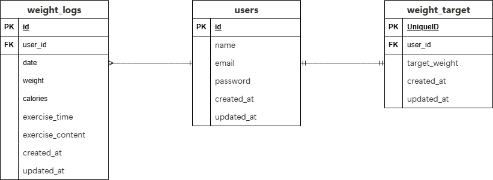

# アプリケーション名
PiGLy（体重管理アプリ）

## 環境構築手順
1. このリポジトリをクローン  
   `git clone git@github.com:sugamura-aya/Pigly.git`
2. Dockerイメージをビルド  
   `docker-compose up -d --build`
3. ファイル権限変更  
   `sudo chown -R $USER:$USER .`
4. PHPコンテナにログイン  
   `docker-compose exec php bash`
5. パッケージインストール  
   `composer install`
6. .env.exampleを.envにコピーして、以下の内容に変更  
   ```env
   DB_HOST=mysql  
   DB_DATABASE=laravel_db  
   DB_USERNAME=laravel_user  
   DB_PASSWORD=laravel_pass
7. docker-compose.yml ファイル内の php: に以下を追記
   ```yaml
   user: "1000:1000"
8. アプリキーの生成  
   `php artisan key:generate`
9. マイグレーション実行  
   `php artisan migrate`
10. ダミーデータ投入（ファクトリ使用）  
    `php artisan db:seed`

## 使用技術・実行環境
このアプリケーションは Laravel と Docker を用いて構築しています。
- Laravel 8.83.8（composer.json 参照）
- PHP 8.1.32（Docker）
- MySQL 8.0.26（Docker）
- Docker 27.5.1
- Docker Compose v2.32.4

※より詳細な環境情報は composer.json および docker-compose.yml をご参照ください。

## ER図
※ ER図は下記画像を参照



## URL
- トップページ（管理画面） : /weight_logs
- 体重登録 : /weight_logs/create
- 体重検索 : /weight_logs/search
- 体重詳細 : /weight_logs/{:weightLogId}
- 体重更新 : /weight_logs/{:weightLogId}/update
- 体重削除 : /weight_logs/{:weightLogId}/delete
- 目標設定 : /weight_logs/goal_setting
- 会員登録 : /register/step1
- 初期目標体重登録 : /register/step2
- ログイン : /login
- ログアウト : /logout

## テストユーザーのログイン情報
- 'name' :　テストユーザー
- 'email' : test2@example.com
- 'password' : password

## 実装状況メモ
- 会員登録画面：完了
  - 未会員者がトップページにアクセス→会員登録画面へ遷移
  - 「次に進む」ボタン→DB登録→初期体重登録画面へ遷移
  - パスワードのハッシュ化、バリデーション設定
- 初期体重登録画面
  - 「アカウント作成」ボタン→DB登録→体重管理画面へ遷移
  - バリデーション設定
- ログイン画面
  - 「ログイン」ボタン→体重管理画面へ遷移
  - 「アカウント作成はこちら」ボタン→会員登録画面へ遷移
  - Fortifyで認証、バリデーション設定
- 体重管理画面
  - 「データを追加」ボタン→モーダルウィンドウ表示→登録機能
  - 「登録」ボタン→DB登録→体重管理画面へ遷移
  - 「えんぴつボタン」→情報更新画面へ遷移
  - 現在体重ー目標体重表示、体重ログ表示
  - 日付検索機能、ページネーション設定、バリデーション設定
- 情報更新画面
  - 「更新ボタン」→DB更新→体重管理画面へ遷移
  - 「ゴミ箱」ボタン→DB削除→体重管理画面へ遷移
  - バリデーション設定
- 目標体重変更画面
  - 「更新ボタン」→DB更新→体重管理画面へ遷移
  - バリデーション設定
